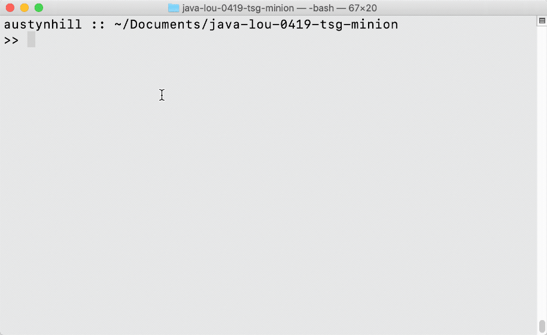
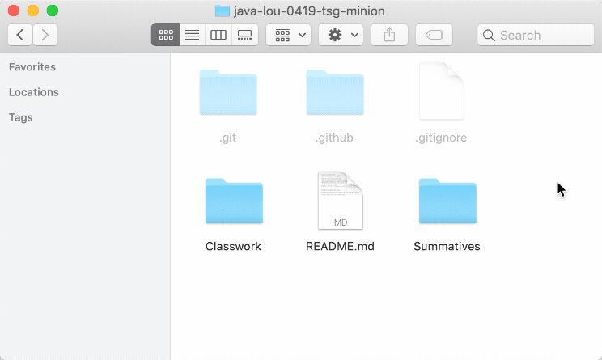
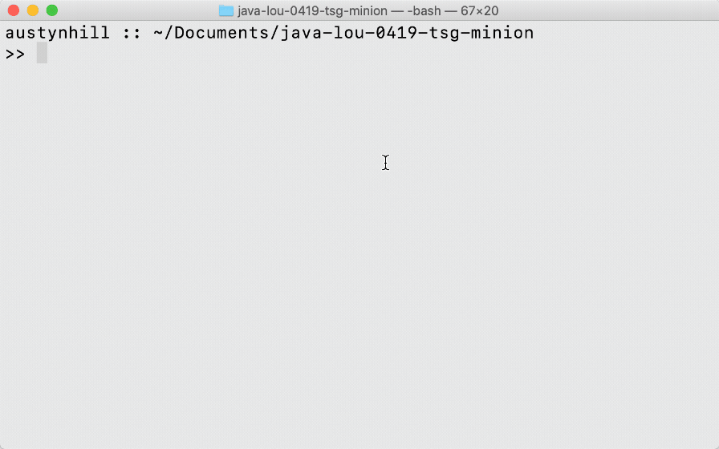
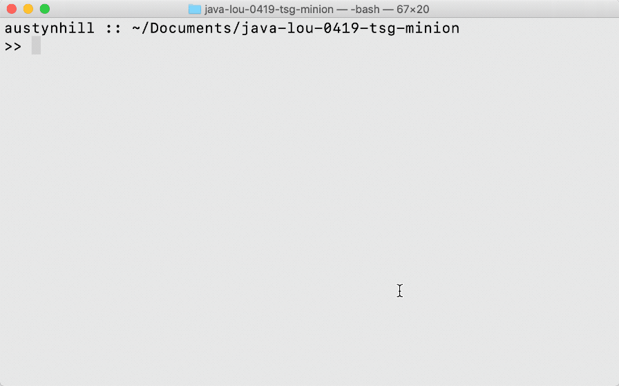

# Welcome to your TSG Classwork Repo!
This is the folder where you'll store all your classwork during the cohort.

Try and keep them organized my Milestone, it'll make things easier for your instructors to find and help you should you run into any issues.

## Classwork Workflow
- #### Make sure you are working in your assignment git repo, and on the MASTER branch! _

Expand for visual how-to example...

_
- #### Make changes in the appropriate work folder & save to your repo _

Expand for visual how-to example...

_
- #### Add the changes, and check that they're staged. _

Expand for visual how-to example...

_
- #### Commit the changes, with a meaningful commit message _

Expand for visual how-to example...

_
- #### Push the changes to the origin master remote master branch _

Expand for visual how-to example...

_