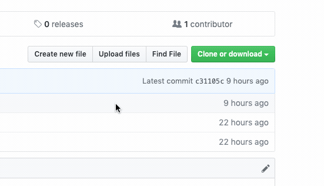
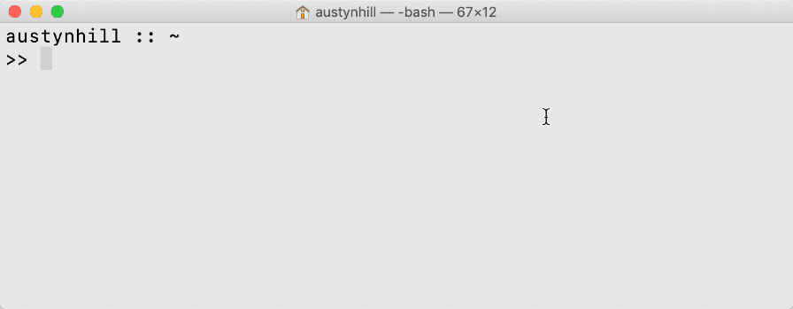
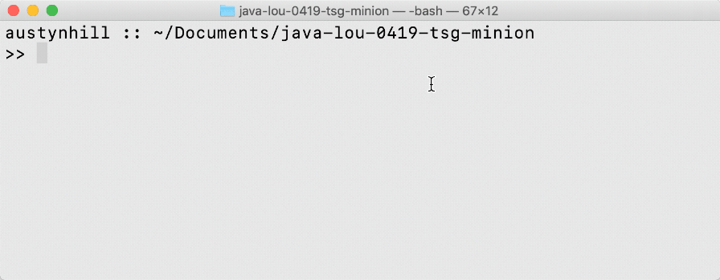

# Welcome to your TSG Apprentice Work Repo!
Congratulations on joining The Software Guild, Apprentice!

You have accepted your assignment, and as a reward you now have a brand new github repository to store & version control all your hard work during your stay with the cohort!

## First Steps - Git It Out of the Cloud, and on your Machine!
- #### Make sure you have Git installed on your local machine
- #### Clone this repository into a well known location (Hint: Your Documents folder is a good idea)
  * You can find the git link in the link to the top right. _

Expand for visual how-to example...

_
  * Use your terminal to navigate to the correct folder & clone! _

Expand for visual how-to example...

_
- #### Navigate to that location and configure your user settings!
  _

Expand for visual how-to example...

_
  
## Continuing work - Your Daily Classwork Workflow
Most of your day-to-day work will be done using this workflow. You'll be coding up interesting things, saving your work into this repo's Classwork folder, and using the following workflow to store it into Git!

**[Read through the Classwork Workflow ReadMe](Classwork/README.md)** inside the Classwork Folder for more details on this workflow and how to use it to save your work.

## Proving Mastery - The Assignment Submission Workflow
Every Milestone within the cohort has a Summative Assignment. 

This is the work that you'll submit to your instructor to review and grade, demonstrating your mastery of that particular Milestone's concepts. The workflow for this submission is different than the daily classwork workflow - so make sure you're familiar with how it works.

**[Read through the Summative workflow ReadMe](Summatives/README.md)** inside the Summatives Folder for more details on this workflow's expectations on how to check in your summative assignments.
