# Summative Assignments!
This is the folder where you'll store all your summative assignments during the cohort.

Similarly to your classwork, try and keep them organized my Milestone - it'll help you and your instructors find the right work when necessary - and minimize merge conflicts!

## Store each assignment in a folder that matches the milestone it was assigned.
- [ ] m1-summative
- [ ] m2-summative
- [ ] m3-summative
- [ ] m4-summative
- [ ] mastery-oop
- [ ] m6-summative
- [ ] m7-summative
- [ ] m8-summative
- [ ] m9-summative
- [ ] mastery-ddwa

## Summative Work Flow using Branches & Pull Requests
1. #### Checkout Summative Branch _

Expand for visual how-to example...
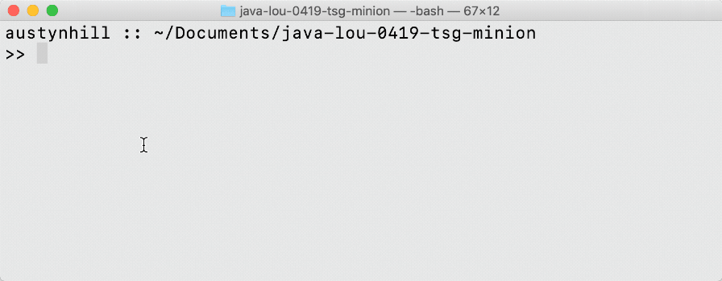
_
1. #### Follow normal git workflow
    1. #### Make changes & save in appropriate work folder _

Expand for visual how-to example...
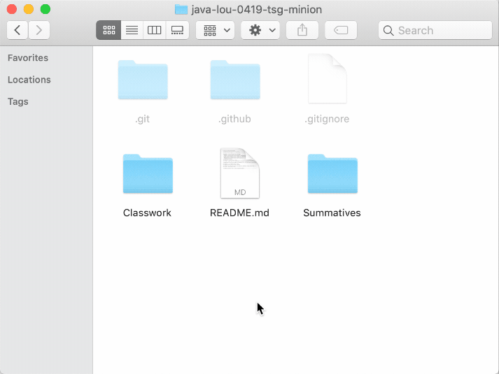
_
    1. #### Add the changes, and check that they're staged _

Expand for visual how-to example...

_ 
    1. #### Commit the changes, with a meaningful commit message _

Expand for visual how-to example...
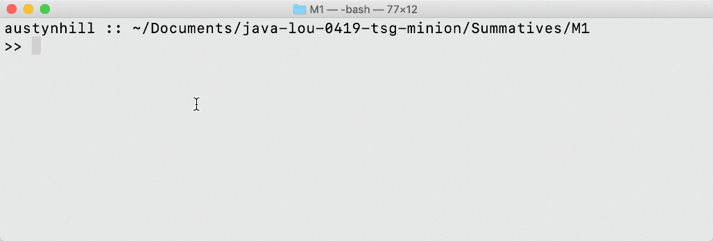
_
    1. #### Push the changes to the origin summative remote _

Expand for visual how-to example...
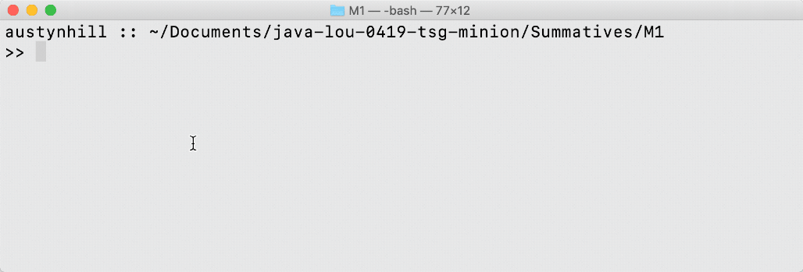
_
1. #### When finished, create pull request from milestone -> master _

Expand for visual how-to example...
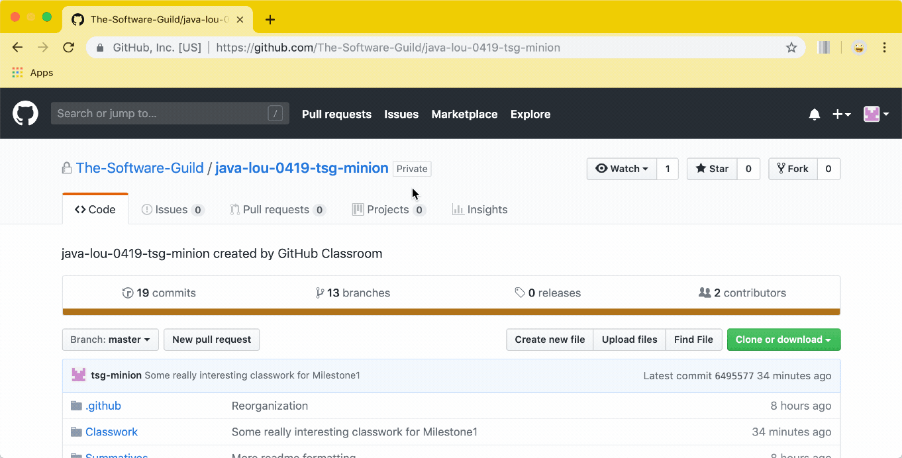
_
    * Add any clarifying questions / comments _

Expand for visual how-to example...
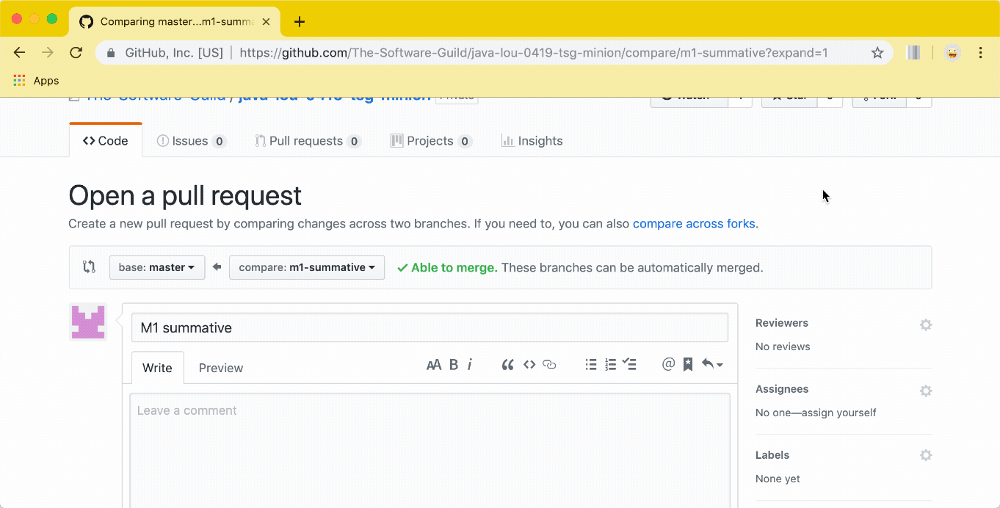
_
    * Assign to self _

Expand for visual how-to example...
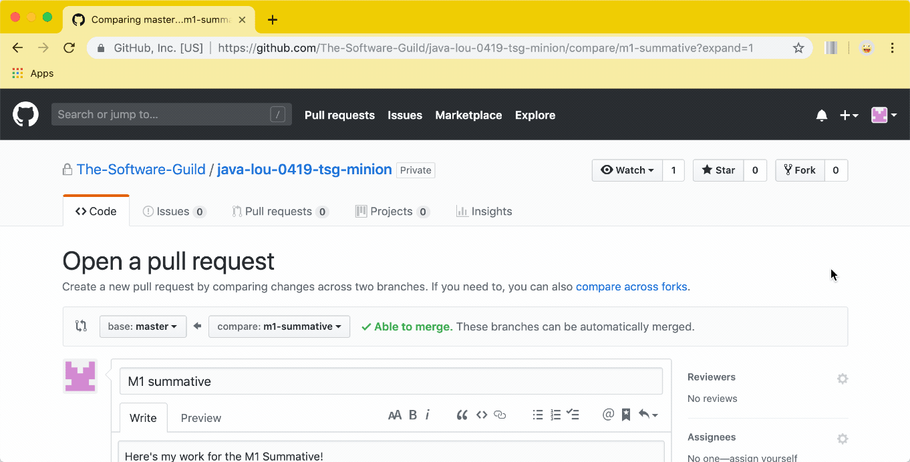
_	
	* Tag Instructor for Review _

Expand for visual how-to example...
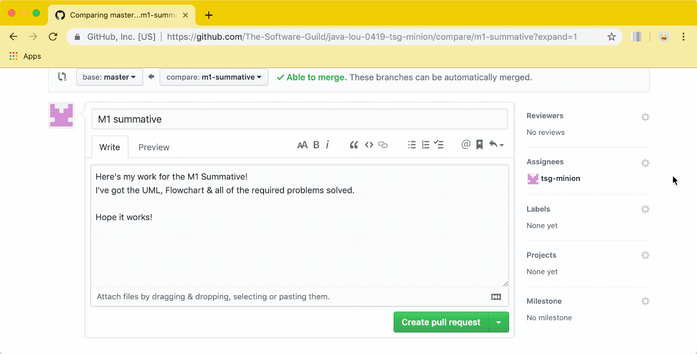
_
	* Start Review _

Expand for visual how-to example...
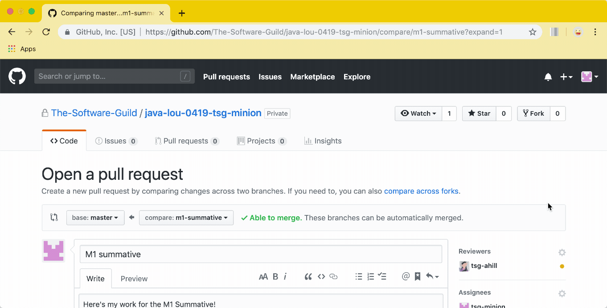
_
	* Submit link to Canvas _

Expand for visual how-to example...
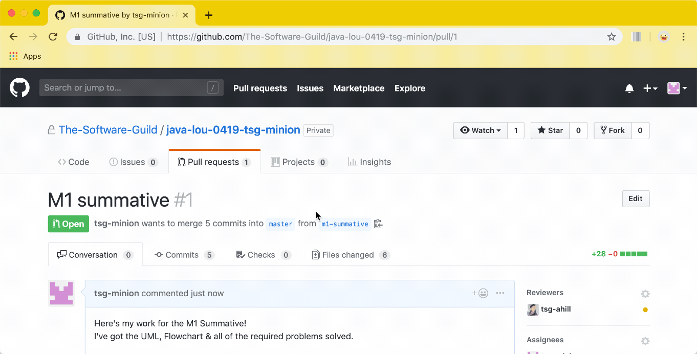
_
1. #### Review Results
  - Navigate to [Github's Pull Dashboard](https://github.com/pulls)
  * If 'Changes Requested' _

Expand for visual how-to example...
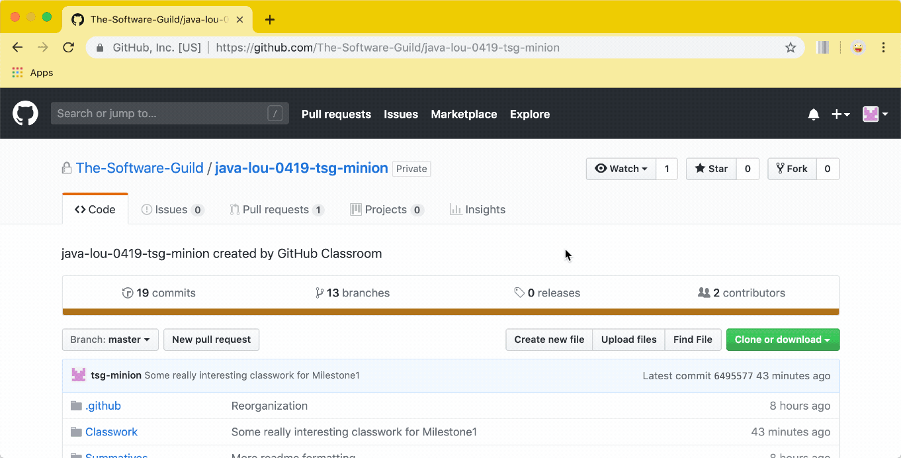
_
    - Create Issues from problematic code _

Expand for visual how-to example...
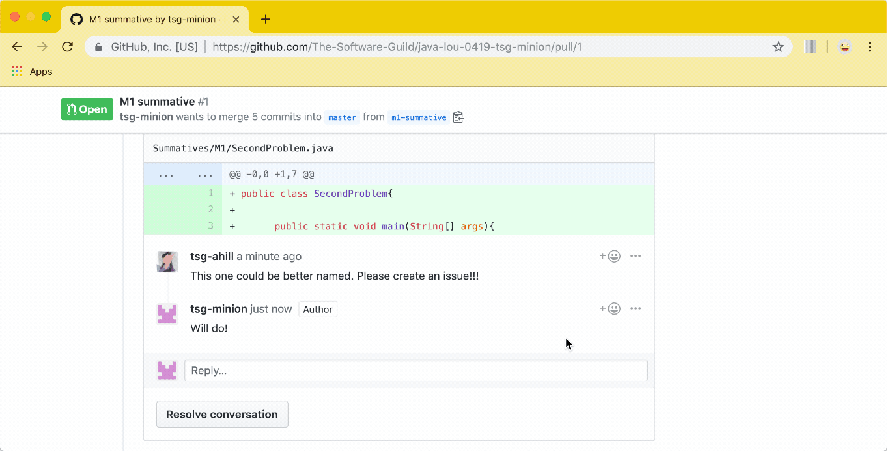
_
    - Make Changes / Add / Commit against Issues & Push to Branch _

Expand for visual how-to example...
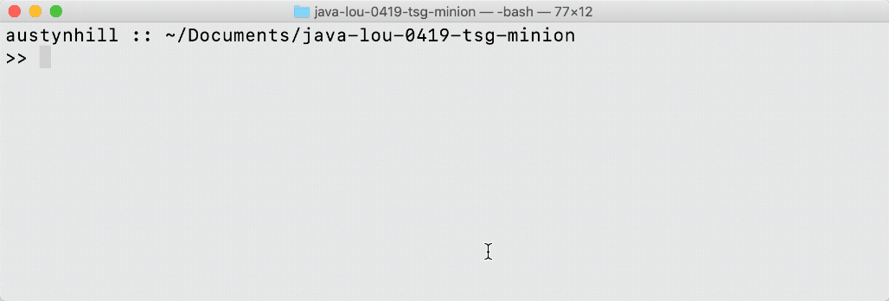
_
    - When complete, resubmit for review (Canvas/PR tag) _

Expand for visual how-to example...
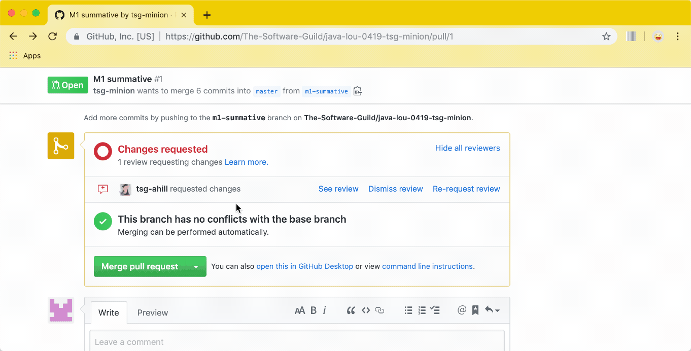
_
  - If 'Approved'
    - Merge w/ Master & Close Branch _

Expand for visual how-to example...
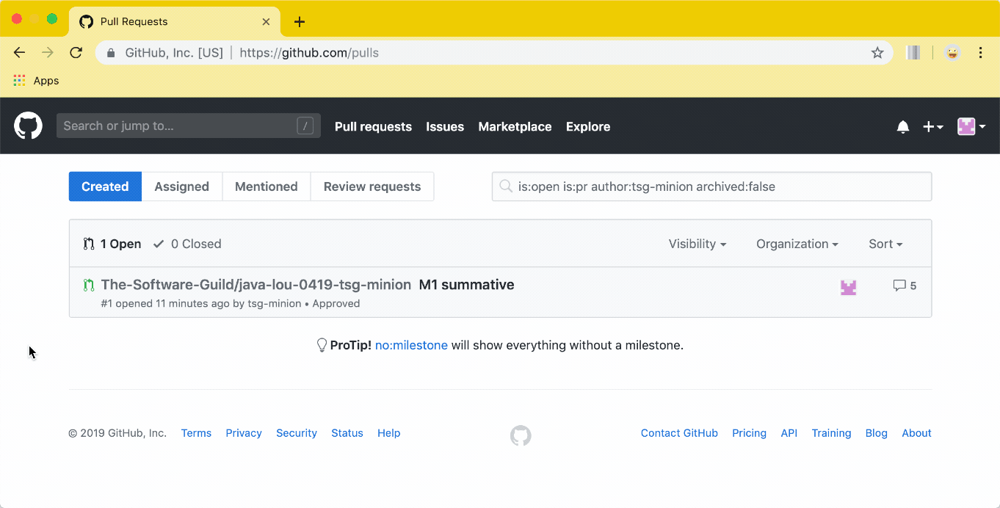
_
    - Checkout Master & Merge Changes To Local Repo _

Expand for visual how-to example...
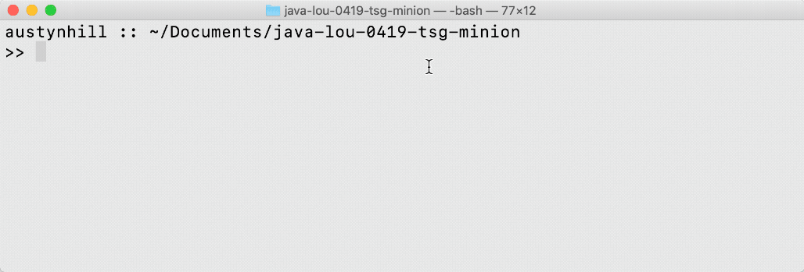
_
